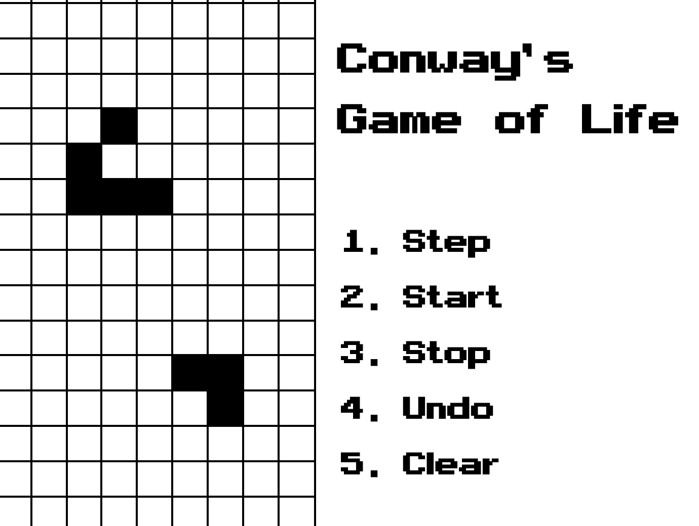

# Conway's Game of Life



A small react browser app for simluating Conway's Game 
of Life. This started as an exercise to learn Jest and
practice writing more complex frontend logic and ended
with a vow to move to learn Typescript.

There are still a couple of bugs in the state management
that I have yet to figure out, but the core functionality
works.

To run the app, clone the repository and run the following
commands in the root directory:

```
yarn install
yarn start
```

To run tests (logic only)
```
yarn test
```